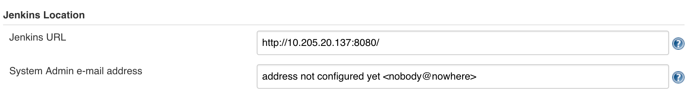
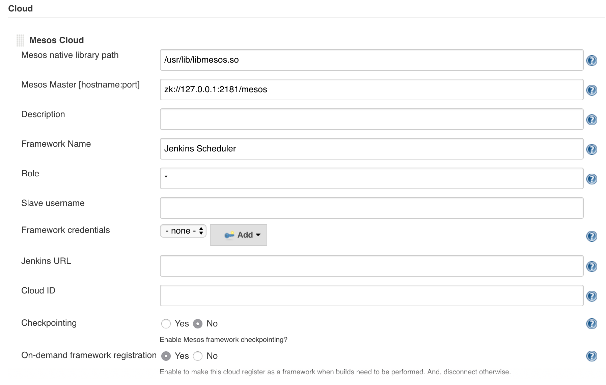
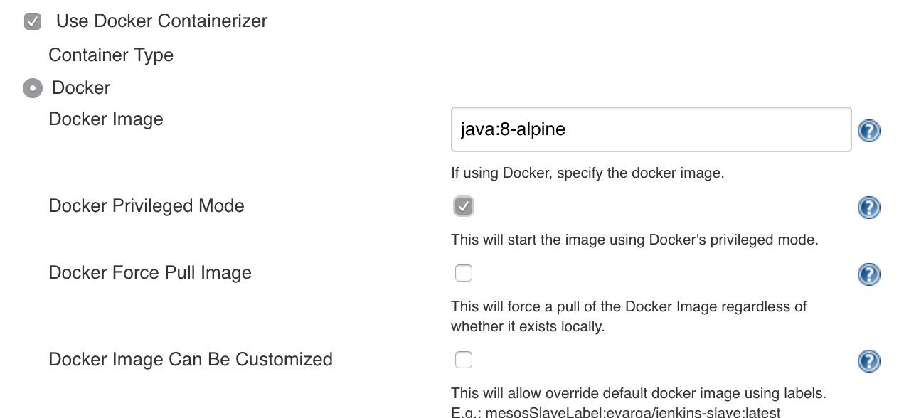

这个Vagrantfile可以创建包含mesos-master/mesos-slave以及Jenkins master和docker服务的虚拟机。

## 配置过程
---
1. `vagrant up --provision-with shell`
2. jenkins initial admin密码可以在provision log最后一部分看到
3. 访问 `localhost:8080` 并用 2中password设置Jenkins
4. 访问`manage jenkins plugins` 并安装 `mesos` plugin，重启Jenkins
5. 访问 `Configure System` 并按照下面去配置，记得将jenkins服务器的地址设置为本机的IP地址，不然mesos slave在启动容器时无法通过java web start的方式启动jenkins的slave:

6. 访问 `Configure Global Security` 做下面的配置:

7. 随意创建一个项目，指定在label是`mesos`的jenkins slave运行，添加一个step,运行inline的shell 脚本，比如`java -version`，保存运行build，可以看到jenkins会向mesos申请资源来启动一个容器并且运行任务。如果ssh到虚拟机上，运行`docker ps`可以看到有一个容器正在运行。

